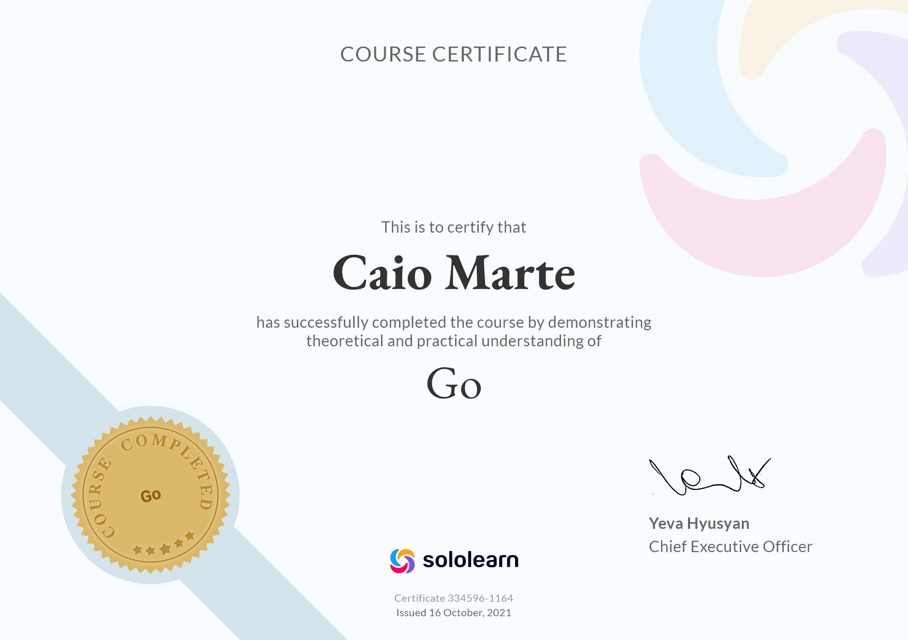

# Go / SoloLearn
Resources produced during [SoloLearn's Go](https://www.sololearn.com/learning/1164) course.

## Content
  - [Getting Started](#getting-started)
  - [Basic Concepts](#basic-concepts)
  - [Functions](#functions)
  - [Pointers & Structs](#pointers--structs)
  - [Array, Range, Map](#array-range-map)
  - [Concurrency](#concurrency)
  - [Certificate of Completion](#certificate-of-completion)

### Getting Started
| i.  | Topic                          | Lesson                       | Practice                       |
| --- | ------------------------------ | ---------------------------- | ------------------------------ |
| 1. | Hello World                     | `null`                       | [1.2.go](./practices/1.2.go)   |
| 2. | Packages                        | [2.1.md](./lessons/2.1.md)   | N/A                            |
| 3. | Imports                         | [3.1.md](./lessons/3.1.md)   | [3.2.go](./practices/3.2.go)   |
| 4. | Comments                        | [4.1.md](./lessons/4.1.md)   | [4.2.go](./practices/4.2.go)   |
| 5. | Module Quiz                     | N/A                          | N/A                            |
| 6. | Code Project                    | N/A                          | [6.go](./projects/6.go)        |

### Basic Concepts
| i.  | Topic                          | Lesson                       | Practice                       |
| --- | ------------------------------ | ---------------------------- | ------------------------------ |
| 7.  | Variables                      | [7.1.md](./lessons/7.1.md)   | N/A                            |
| 8.  | Data Types                     | [8.1.md](./lessons/8.1.md)   | [8.2.go](./practices/8.2.go)   |
| 9.  | Constants                      | [9.1.md](./lessons/9.1.md)   | N/A                            |
| 10. | Arithmetic Operators           | [10.1.md](./lessons/10.1.md) | [10.2.go](./practices/10.2.go) |
| 11. | Relational & Logical Operators | [11.1.md](./lessons/11.1.md) | N/A                            |
| 12. | Taking Input                   | [12.1.md](./lessons/12.1.md) | [12.2.go](./practices/12.2.go) |
| 13. | If/else                        | [13.1.md](./lessons/13.1.md) | [13.2.go](./practices/13.2.go) |
| 14. | Switch                         | [14.1.md](./lessons/14.1.md) | [14.2.go](./practices/14.2.go) |
| 15. | Loops                          | [15.1.md](./lessons/15.1.md) | [15.2.go](./practices/15.2.go) |
| 16. | Module Quiz                    | N/A                          | N/A                            |
| 17. | Code Project                   | N/A                          | [17.go](./projects/17.go)      |

### Functions
| i.  | Topic                          | Lesson                       | Practice                       |
| --- | ------------------------------ | ---------------------------- | ------------------------------ |
| 18. | Introducing Functions          | [18.1.md](./lessons/18.1.md) | [18.2.go](./practices/18.2.go) |
| 19. | Arguments                      | [19.1.md](./lessons/19.1.md) | [19.2.go](./practices/19.2.go) |
| 20. | Returning From Functions       | [20.1.md](./lessons/20.1.md) | [20.2.go](./practices/20.2.go) |
| 21. | Defer                          | [21.1.md](./lessons/21.1.md) | N/A                            |
| 22. | Scope                          | [22.1.md](./lessons/22.1.md) | N/A                            |
| 23. | Module Quiz                    | N/A                          | N/A                            |
| 24. | Code Project                   | N/A                          | [24.go](./projects/24.go)      |

### Pointers & Structs
| i.  | Topic                          | Lesson                       | Practice                       |
| --- | ------------------------------ | ---------------------------- | ------------------------------ |
| 25. | Pointers                       | [25.1.md](./lessons/25.1.md) | N/A                            |
| 26. | Passing Pointers to Functions  | [26.1.md](./lessons/26.1.md) | [26.2.go](./practices/26.2.go) |
| 27. | Structs                        | [27.1.md](./lessons/27.1.md) | [27.2.go](./practices/27.2.go) |
| 28. | Pointers to Structs            | [28.1.md](./lessons/28.1.md) | [28.2.go](./practices/28.2.go) |
| 29. | Methods                        | [29.1.md](./lessons/29.1.md) | [29.2.go](./practices/29.2.go) |
| 30. | Module Quiz                    | N/A                          | N/A                            |
| 31. | Code Project                   | N/A                          | [31.go](./projects/31.go)      |

### Array, Range, Map
| i.  | Topic                          | Lesson                       | Practice                       |
| --- | ------------------------------ | ---------------------------- | ------------------------------ |
| 32. | Arrays                         | [32.1.md](./lessons/32.1.md) | [32.2.go](./practices/32.2.go) |
| 33. | Slices                         | [33.1.md](./lessons/33.1.md) | [33.2.go](./practices/33.2.go) |
| 34. | Range                          | [34.1.md](./lessons/34.1.md) | [34.2.go](./practices/34.2.go) |
| 35. | Maps                           | [35.1.md](./lessons/35.1.md) | [35.2.go](./practices/35.2.go) |
| 36. | Variadic Functions             | [36.1.md](./lessons/36.1.md) | [36.2.go](./practices/36.2.go) |
| 37. | Module Quiz                    | N/A                          | N/A                            |
| 38. | Code Project                   | N/A                          | [38.go](./projects/38.go)      |

### Concurrency
| i.  | Topic                          | Lesson                       | Practice                       |
| --- | ------------------------------ | ---------------------------- | ------------------------------ |
| 39. | Intro                          | [39.1.md](./lessons/39.1.md) | N/A                            |
| 40. | Goroutines                     | [40.1.md](./lessons/40.1.md) | N/A                            |
| 41. | Channels                       | [41.1.md](./lessons/41.1.md) | [41.2.go](./practices/41.2.go) |
| 42. | Select                         | [42.1.md](./lessons/42.1.md) | N/A                            |
| 43. | Module Quis                    | N/A                          | N/A                            |
| 44. | Code Project                   | N/A                          | [44.go](./projects/44.go)      |

---
## Certificate of Completion

